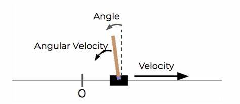
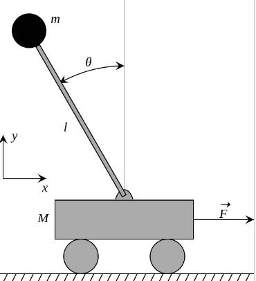
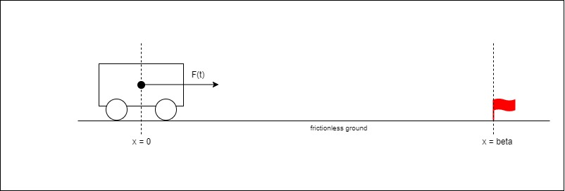
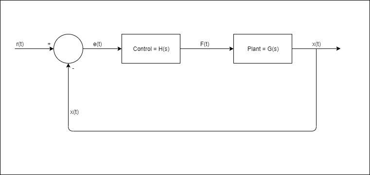
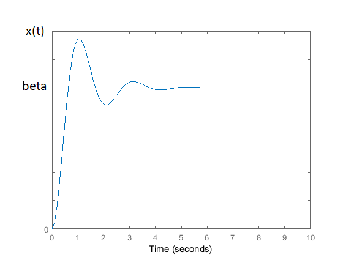
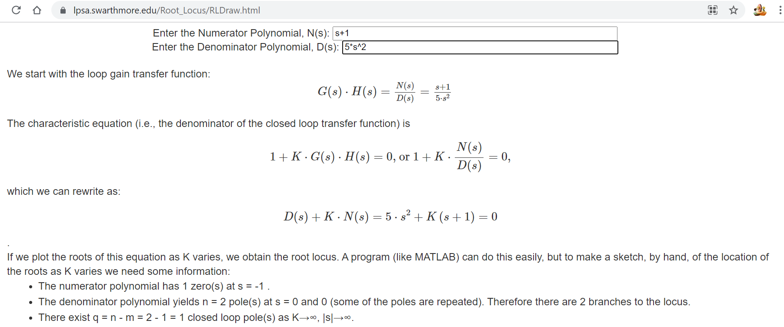
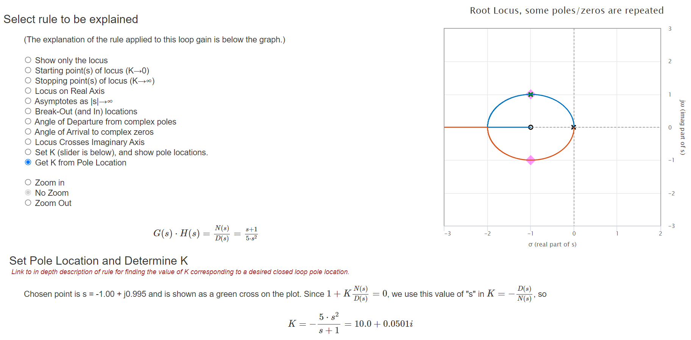

# 1. An easy SISO problem
In control theory, an easy problem often has the `model` being "Single Input Single Output"(a.k.a. `SISO`) -- note that there's no restriction for the `plant` to be SISO here, which would soon be explained.   

Let's use the ["CartPole balancing" game](https://jeffjar.me/cartpole.html) for further discussion. 

In this game the `plant` is the whole game mechanics, where you have lots of params to control, e.g. `position of cart`, `velocity of cart`, `tilted angle of pole` and `angular velocity of pole` just to name a few. Therefore it's obvious that this `plant` is not SISO. 



Now that in the balancing only problem, we care solely about the `theta = tilted angle of pole` as an output, and the `F = horizontal force on cart` as an input. 



Without a proof, let's just say that the relation between `theta` and `F` is given by 

```
d^2(theta)/dt^2 = somefunc(F)
```

well that's like ballsit, but the `somefunc` is actually not important to know for now unless you're a physics guru. What's really important is the fact that both `theta = theta(t)` and `F = F(t)` being `time-domain functions`, and thus we formulate the problem as follows
```
Problem#a

Given dynamics
- d^2(theta(t))/dt^2 = somefunc(F(t)), the SISO model for the dynamics -- (1.1.1)

Given constraints
- r(t) = 0, a constant reference output of all time i.e. ideally we want theta(t) to always be 0 -- (1.1.2)
- theta(t=0) = alpha > 0, some constant initial condition that the problem starts with i.e. otherwise you can just use F(t) = 0 as a solution -- (1.1.3)
- TUpper, a constant time limit under which we want to solve the problem i.e. when t in [0, TUpper] -- (1.1.4)
- halfSigma = 5*PI/180, a constant limit where |r(t)-theta(t)| < 5*PI/180 should be satisfied when t in [0, TUpper] -- (1.1.5)

Compute
- F(t) to satisfy the "halfSigma" constraint when t in [0, TUpper] 
```

# 2. PD Control
## 2.1 An even easier problem 
Though `Problem#a` is a good example for many control theory lectures, it's seemingly non-trivial to solve for greenhand, let's leave it aside for now and take on an even easier problem, which uses only `Newton's second law`.

```
Problem#b

Text description
- We have a cart(no pole) on a "frictionless ground" i.e. only the x-axis. It's small enough to be deem a "point mass (valued m)" on the x-axis, and initially sitting at "x = 0". The purpose is the drag the cart to "x = beta" and let it stay there till some time limit TUpper. Note that you can drag it to "x = beta" and apply force to make it vibrate around that point, no need to worry about putting the cart exactly at "x = beta & dx/dt = 0" -- this problem#b is meant to be super easy :)

Given dynamics
- d^2(x(t))/dt^2 = F(t)/m -- (2.1.1)

Given constraints
- r(t) = beta, a constant reference output of all time i.e. ideally we want x(t) to always be beta -- (2.1.2)
- x(t=0) = 0 & [d(x(t))/dt|t=0] = 0, i.e. starts at 0 with 0 velocity -- (2.1.3)
- TSettle, a constant time limit under which we want to solve the problem i.e. when t in [0, TSettle] -- (2.1.4)  
- halfSigma = 5%, a constant limit where |r(t)-x(t)| < 5%*beta should be satisfied when t in [TSettle, +Infinity] -- (2.1.5)

Compute
- F(t) to satisfy the "halfSigma" constraint when t in [0, TSettle]
```



## 2.2 Design of a "closed loop control"
If we know `x(t)` at any moment of time, then a `closed loop control` diagram can be drawn as follows. 

_Figure 2.2-1_


Assume that `Control(s)` works like

```
F(t) = Kp*e(t) + Kd*(d(e(t))/dt)
```

, again you're reminded that this `F(t) & e(t) relation` is merely an assumption by now, therefore 
```
d^2(x(t))/dt^2 = F(t)/m = (Kp/m)*r(t) - (Kp/m)*x(t) + (Kd/m)*(d(r(t))/dt) - (Kd/m)*(d(x(t))/dt) -- (2.2.1)
```
, and without knowledge of [Laplace transform](https://byjus.com/maths/laplace-transform/) there's not much you can do from here.


## 2.3 What to expect?
However working out the math details is not the focus here, the keypoint here is that with proper choice of `Kd` and `Kp`, you can end up with `lim x(t)/r(t) == 1, t -> +Infinity` and more preferably `|r(t)-x(t)| < 5%*beta when t in [TSettle, +Infinity]`, as well as a time-domain response like the following diagram.

_Figure 2.3-1_



## 2.4 How to make the expectation happen?
Introducing some special cases of [Laplace transform](https://byjus.com/maths/laplace-transform/)
```
Lap(const*x(t), s) = const*X(s) -- (2.4.1)
Lap(d(x(t))/dt, s) = s*X(s)-x(t=0) -- (2.4.2)
Lap(d^2(x(t))/dt^2, s) = s^2*X(s)-s*x(t=0)-[d(x(t))/dt|t=0] -- (2.4.3)
```

Be very careful, `Lap(const, s) != const` and can be easily verified by its definition, the `equation (2.4.1)` holds merely because Laplace operation is linear, which is out of scope for this chapter.

From `equation (2.1.3)`, we can simplify both `equations (2.4.2) & (2.4.3)` for problem#b, taking the Laplace transform of `equation (2.2.1)` results in 
```
s^2*X(s) + s*(Kd/m)*X(s) + (Kp/m)*X(s) = s*(Kd/m)*R(s) + (Kp/m)*R(s) -- (2.4.4)
```
which is equivalent to 
```
X(s)/R(s) = (s*Kd + Kp)/(s^2*m + s*Kd + Kp) -- (2.4.5)
```

Before moving on, let's look at _Figure 2.2-1_ solely in the s-domain.
```
G(s) = 1/m*s^2 -- (2.4.6)
H(s) = (s*Kd + Kp) -- (2.4.7)
E(s) = R(s) - X(s) -- (2.4.8)
X(s) = G(s)*H(s)*E(s) = G(s)*H(s)*(R(s) - X(s)) -- (2.4.9)

X(s)/R(s) = G(s)*H(s)/(1+G(s)*H(s)) = (s*Kd + Kp)/(s^2*m + s*Kd + Kp) -- (2.4.10)
```

This equivalence of `equations (2.4.5) & (2.4.10)` is very important, because it implies that **consecutive blocks in the diagram can be "directly multiplied in s-domain"**, which is way more convenient than preparing in "t-domain".

Without rigorous proof, you're guaranteed that
```
The "pole"s of equation (2.4.5), i.e. the roots for the denominator "s^2*m + s*Kd + Kp", has an impact for "Figure 2.3-1", e.g. on whether it settles and how quickly it settles.  
```

Some quick facts.
- If roots "s1 = a+b*i, s2 = a-b*i" are on the "left half plane (a.k.a. LHP)", i.e. a < 0, then "Figure 2.3-1" will finally settle -- but not necessarily "converge", i.e. vibrating around a value isn't converging.
- The technique to choose "s1, s2" to meet specific requirements of "Figure 2.3-1", e.g. peak overshoot, settling time and rise time, is called "pole placement".

Let's try out placing a "nearly arbitrary" pole for our problem#b by assuming "m = 5, Kp = Kd = K" (just to reduce degrees of freedom), now `equation (2.4.10)` becomes 
```
X(s)/R(s) = K*(s + 1)/(5*s^2 + K*(s + 1)) -- (2.4.11)
```
, and use [this online tool](https://lpsa.swarthmore.edu/Root_Locus/RLDraw.html) to draw `the trajectory of roots "s1, s2" to the denominator "5*s^2 + K*(s + 1)" as "K: 0 -> +Infinity"`.

_Figure 2.4-1_ _(note that the factor "K" is extracted out from `equation (2.4.6)*(2.4.7)` for drawing alignment)_



_Figure 2.4-2_ _(you can deem blue arc as trajectory of root "s1" as `K: 0 -> +Infinity`, and red arc as that of root "s2")_



By now you have a "K" and the chosen pole is not on RHP, meaning that the system will stabilize. However we've by far omitted the `design requirements` (usually but not always `PeakOvershoot, RiseTime, SettlingTime`), i.e. `equations (2.1.4) & (2.1.5)`. That's OK just implement the ideas by far, after some trial and error I believe these 2 videos are self-explanatory enough about "pole placement", especially for how to comply with `design requirements`.
- https://pan.baidu.com/s/1JXm1HxEnuP1sYJY6HH-ZDA (6w33)
- https://pan.baidu.com/s/1Ad1Co7zpsP7fLqnqIxTKvw (5s6c)

Please keep in mind that the relations found between `design requirements` and `design parameters` in the 2 videos above are limited to `2nd order dynamic system`, i.e. `a*d^2(x(t))/dt^2 + b*d(x(t))/dt + c*x(t) = 0`. That said, for the general case aligning `design parameters` to given `design requirements` would require simultaneous/coupling use of the following diagrams/tools.
- `root Locus` of the `closed loop transfer function` w.r.t. the `design parameters`
- `step response` with automatically marked `PeakOvershoot, RiseTime, SettlingTime` of the `closed loop transfer function` for certain chosen poles by tuning the `design parameters` 

# 2.5 Implementation reference
[This script can be deemed a "2D with gravity example"](../lunarlander_pid_only.py) for problem#b in the sense of controlling only a point mass, also without any concern of `design requirements`.